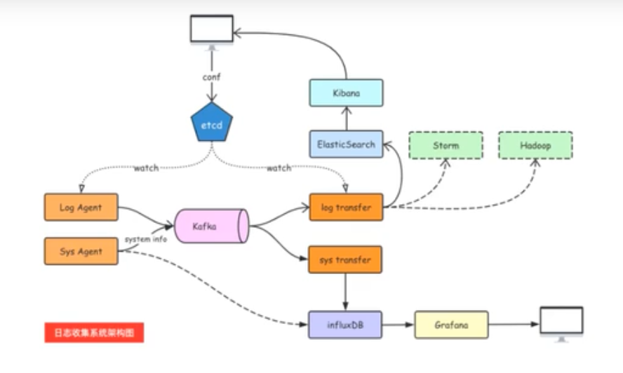

# logagent

## 工作流程
+ tail读取日志文件（https://github.com/hpcloud/tail）
+ sarama往kafka写日志（https://github.com/Shopify/sarama）
## windows
### java
https://www.oracle.com/java/
### kafka
http://kafka.apache.org/
### zookeeper
```bash
bin\windows\zookeeper-server-start.bat config\zookeeper.properties
```
### kafka
```bash
bin\windows\kafka-server-start.bat config\server.properties
```
### consumer
```bash
bin\windows\kafka-console-consumer.bat --bootstrap-server=127.0.0.1:9092 --topic=web_log --from-beginning
```